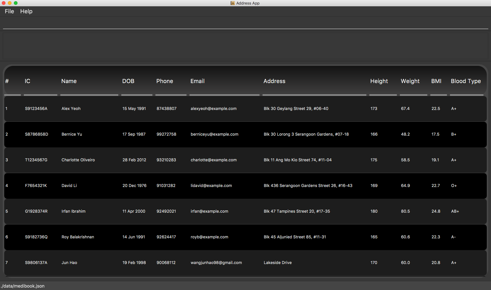

# CS2103T-F13-3

If you would like to know more [about us](https://ay2021s1-cs2103t-f13-3.github.io/tp/AboutUs.html).

## MediBook

MediBook is a desktop app for managing patient records, optimised for use via a Command Line Interface (CLI) while still having the benefits of a Graphical User Interface (GUI). If you can type fast, MediBook can get your patient records management tasks done faster than traditional GUI apps.

MediBook aims to increase efficiency in a clinical setting by providing a convenient interface for clinical staff to record and keep track of patient details.

* If you are interested in using MediBook, head over to our [User Guide](https://ay2021s1-cs2103t-f13-3.github.io/tp/UserGuide.html).
* If you are interested in further developing MediBook, head over to our [Developer Guide](https://ay2021s1-cs2103t-f13-3.github.io/tp/DeveloperGuide.html).

### Acknowledgement
This project is based on the AddressBook-Level3 project created by the [SE-EDU initiative](https://se-education.org).
