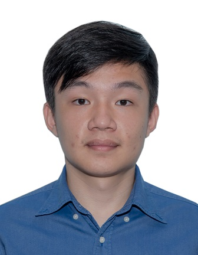
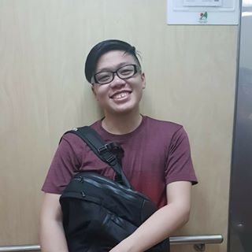

We are a team based in the [School of Computing, National University of Singapore](http://www.comp.nus.edu.sg).

You can reach us at wangjunhao@u.nus.edu, foojingyi@u.nus.edu, E0415577@u.nus.edu, divakar@u.nus.edu, e0425943@u.nus.edu.

## Project Team

### Wang Jun Hao

[[github](https://github.com/wang-jun-hao)]
[[portfolio](team/wang-jun-hao.md)]

* Role: **Leader**
* Responsibilities:
    * Team Lead
    * Deliverables and Deadlines

### Divakar

[[github](http://github.com/divakarmal)]
[[portfolio](team/divakarmal.md)]

* Role: **Developer**
* Responsibilities:
    * Documentation

### Wong Zheng Zhi

[[github](https://github.com/Wong-ZZ)]
[[portfolio](team/wong-zz.md)]

* Role: **Developer**
* Responsibilities:
    * Integration
    * Testing

### Foo Jing Yi

[[github](https://github.com/foojingyi)]
[[portfolio](team/foojingyi.md)]

* Role: **Developer**
* Responsibilities:
    * Code Quality

### Preston Toh

[[github](http://github.com/PrestonTYR)]
[[portfolio](team/prestontyr.md)]

* Role: **Developer**
* Responsibilities:
    * Scheduling and Tracking
