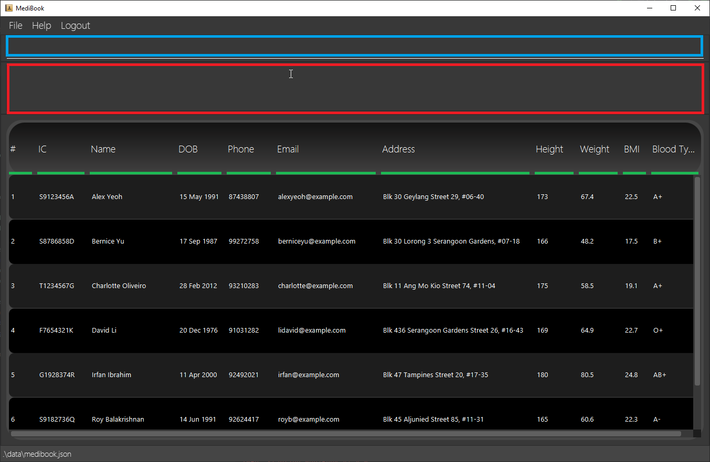

<h1>MediBook User Guide: Everything you need to know about MediBook</h1>
* Table of Contents
{:toc}

## 1. Introduction

### 1.1 Welcome to MediBook

MediBook is a **desktop medical records software targeting doctors and administrative staffs in clinics or hospitals to 
help manage patient details.** It is **optimized for use via a Command Line Interface** (CLI) while 
still having the benefits of a Graphical User Interface (GUI). If you can type fast, MediBook can get your patient 
details management tasks done faster than traditional methods.

### 1.2 Overview

This user guide contains everything that you will need to know about MediBook. The information contained in this user guide will be useful to both new and experienced users alike.

[Section 2. Quick start](#2-quick-start) contains information for new users who wish to start using Medibook.

[Section 3. Features](#3-features) contains all the details of the the different features that MediBook provides. The description and/or sample usage for each feature is provided so that users can easily learn how to use each feature.

[Section 4. FAQ](#4-faq) provides answers to typical issues which users might have that are not covered in the previous sections.

[Section 5. Command summary](#5-command-summary) summarizes the format for each command in a table. This is particularly useful for users who simply wish to have a quick reference on the correct format for the commands.

--------------------------------------------------------------------------------------------------------------------

## 2. Quick start

### 2.1 Setting up

1. Ensure you have Java 11 or above installed in your Computer.
2. Download the latest medibook.jar from [https://github.com/AY2021S1-CS2103T-F13-3/tp/releases](https://github.com/AY2021S1-CS2103T-F13-3/tp/releases).
3. Copy the file to the folder you want to use as the home folder for your MediBook.
4. Double-click the file to start the app.
5. Login to the program or create an account if you do not already have one.
6. Type the command in the command box and press Enter to execute it. e.g. typing `help` and pressing Enter will open the help window.
7. Refer to the Features below for details on each command.

### 2.2 Starting MediBook for the first time

After starting up MediBook, you should be greeted by the login screen as seen below. New users should click on the
`Create` button to proceed with creating a new account.

After clicking on the `Create` button, you should see the account creation page as seen below.
Proceed with filling in the relevant details for your account.
For more information about account creation, refer to [Section 3.1 Login and Create Account](#31-login-and-create-account).

If the account creation is successful, you should now be brought to the main page where you can view the details of all the patients.

The Command Box (marked by the blue rectangle) is where users type the commands needed to use MediBook.

The Result Display (marked by the red rectangle) is where MediBook displays the result/error for each command input by the user.

The screenshot below shows the patient profile page which you can enter by [accessing a patient's profile](#327-accessing-a-patients-profile--access).
The patient profile page displays the specific patient's medical details, medical notes and charts of the patient's height, weight and BMI.

For more information regarding the features, refer to the next section!

---------------------------------------------------------------------------------------------------------------

## 3. Features

Listed below are the features of MediBook.

**:information_source: Notes about patients in MediBook:** 

MediBook stores patients with their personal details, medical details and medical notes. A representation of any
specified patient in MediBook can be added, edited, deleted or found using commands. Here are some things to take note when dealing with patient records in MediBook:
  * The personal detail fields are: `IC`, `NAME`, `DATE_OF_BIRTH`, `PHONE_NUMBER`, `EMAIL`, `ADDRESS`, `HEIGHT`, `WEIGHT`, `BLOOD_TYPE` and `BMI`.
  `BMI` is the only non-editable field since it is automatically calculated from `HEIGHT` and `WEIGHT`.
  * The medical detail fields are: `ALLERGY`, `CONDITION` and `TREATMENT`.
  * `IC` should be of the format @xxxxxxx#, where @ is a letter S, T, F or G, xxxxxxx is a 7 digit number and # is any letter.
  * `NAME` should only have alphanumeric characters and spaces.
  * `DATE_OF_BIRTH` should be given in the format "DD-MM-YYYY" where D, M and Y represent digits of the day, month and year of the date respectively.
  * `PHONE_NUMBER` has to be within 7 to 15 digits long (to support international numbers).
  * `EMAIL` Emails should be of the format "local-part@domain" and adhere to the following constraints:
    * The local-part should only contain alphanumeric characters and these special characters, excluding parentheses, (!#$%&'*+/=?`{&#124;}~^.-").
    * This is followed by a '@' and then a domain name. The domain name must:
        * be at least 2 characters long
        * start and end with alphanumeric characters
        * consist of alphanumeric characters, a period or a hyphen for the characters in between, if any.
  * `ADDRESS` can take any values but should not be blank.  
  * `HEIGHT` must be a whole number between 1 - 299 inclusive and is measured in cms.
  * `WEIGHT` must be a positive number correct to 1 decimal place and is measured in kgs.
  * `BLOOD_TYPE` must be a valid blood type i.e. one of A, B, O or AB followed by '+' or '-". For example A+, AB- etc.
  * If multiple values for the same personal detail field are given, MediBook accepts the last value. 
    Eg. if you type `add i/S9123456A n/Divakar d/29-02-2000 p/91234567 b/A+ b/O+`, O+ will be accepted as the actual blood type.
  * For medical detail fields i.e. `ALLERGY`, `CONDITION` and `TREATMENT`, any number of entries can be specified, following the given format for each entry.
  All entries will be added. Note that entries are not cumulative over different command instances 
  i.e. when you edit a patient's allergies, all the original allergies will be overwritten (and the same goes for other medical detail fields).

### 3.1 Login and Create Account

#### 3.1.1 Logging In

When you first startup MediBook, you will be presented with the following login screen.

Type in your `username` and `password` to login to the system as a **doctor**.
As a **doctor**, you can use all features of MediBook.

If you do not have a `username` and `password`, pick the
`create account` option, which would let you create a new **doctor** account.

Alternatively, you can also login as an **administrative staff** using the username: `admin` and password: `admin`. 
As an **administrative staff**, you can only add, edit, delete and find patients. 
You are unable to add, edit or delete medical notes.

#### 3.1.2 Creating Account

When creating your new account, fill in your desired `username`, `password`, your `name` and your `MCR`, then click create.

* `username` and `password` need to be at least 5 characters long.
* `MCR` is your medical registration number as given by the Singapore Medical Council, e.g. 'M35477G'.
* `MCR` has to be of the format 'M@####$', where @ is a letter/digit, # is a digit and $ is a letter.

#### 3.1.3 Logout

At any point when using the app, the user can choose to logout and return to the login screen by either using the option
in the menu bar at the top or using the key `F2`.

### 3.2 Commands

Use the follow commands by typing into the command box and hitting enter.

**:information_source: Notes about the command format:** 

* Words in `UPPER_CASE` are the parameters to be supplied by the user. 
  e.g. in `add i/IC`, `IC` is a parameter which can be used as `add i/S91234567A`.

* Parameters in square brackets are optional, whilst parameters not in square brackets are compulsory for that command. 
  e.g `n/NAME [w/WEIGHT]` can be used as `n/John Doe w/60.5` or as `n/John Doe`.

* Parameters can be in any order. 
  e.g. if the command specifies `n/NAME p/PHONE_NUMBER`, `p/PHONE_NUMBER n/NAME` is also acceptable.

#### 3.2.1 Viewing help : `help`

Shows a message explaining how to access the help page.

**Format:**

`help`

#### 3.2.2 Listing all patients: `list`

Shows a list of all patient's records in the system.

**Format:**

`list`

Anything typed after list will be ignored and the list of all patient records will be displayed.

#### 3.2.3 Adding a patient: `add` 

Adds a patient to the system.

**Format:**

`add i/IC n/NAME d/DATE_OF_BIRTH p/PHONE_NUMBER [e/EMAIL] [a/ADDRESS] [h/HEIGHT] [w/WEIGHT] [b/BLOOD_TYPE] 
[al/ALLERGY]... [con/CONDITION]... [t/TREATMENT]...`

**Examples:**

*  `add i/T0123456Q n/Divakar d/29-02-2000 p/91234567 e/divakarmal@medibook.com a/NUS, Kent Ridge Drive h/178 w/75.0 b/O+
al/Peanut con/Mitral valve prolapse con/asthma t/EpiPen t/metered-dose inhaler`

*  `add i/S9123579A n/Jon d/29-02-2000 p/91234567`

#### 3.2.4 Editing a patient: `edit` 

Edits the specified patient's information from MediBook. 

The `edit` command is also used to fill in unspecified fields.

**Format:**

`edit INDEX [i/IC] [n/NAME] [d/DATE OF BIRTH] [p/PHONE] [e/EMAIL] [a/ADDRESS] [h/HEIGHT] [w/WEIGHT] [b/BLOOD TYPE] 
[al/ALLERGY]... [con/CONDITION]... [t/TREATMENT]...`

* You have to be on the main list page to access a patient's profile. Use the `list` command to return to the main list page if you are viewing a patient's profile.
* `edit` on a field that already exists will update it from the previous value to the new value.
* `edit` on an optional field that was not specified at the point of adding patient will fill the field with the given value.
* `edit` on a medical detail field i.e. `ALLERGY`, `CONDITION` and `TREATMENT` will replace all original values in the field.

**Examples:**

*  `edit 3 n/Divakar p/91111111 h/201` edits the name, phone number and height of patient with index `3` in the displayed list to `Divakar`, `91111111` and `201`cm  respectively

*  `edit 4 n/John` edits the name of patient with index `4` in the displayed list to `John`

#### 3.2.5 Deleting a patient : `delete`

Deletes the specified patient from MediBook.

**Format:**

`delete INDEX`

* You have to be on the main list page to access a patient's profile. Use the `list` command to return to the main list page if you are viewing a patient's profile.

**Example:**
* `delete 3` deletes the patient with index `3` in the displayed list

#### 3.2.6 Finding a patient: `find`

Finds patient records by multiple fields and multiple keywords.

**Format:**

`find [i/IC] [n/NAME] [d/DATE_OF_BIRTH] [p/PHONE_NUMBER] [e/EMAIL] [a/ADDRESS] [h/HEIGHT] [w/WEIGHT] [b/BLOOD_TYPE]`

* You have to be on the main list page to access a patient's profile. Use the `list` command to return to the main list page if you are viewing a patient's profile.
* At least one field must be specified for the command to be valid.
* The search is case-insensitive. e.g `S9123456A` will match `s9123456a`.
* The search will match substrings e.g `S912345` will match `S9123456A`.
* Search will return all records that matches any of the keywords for each field e.g `n/Alice Bob` will return the records of all patients with name containing `Alice` or `Bob`.

**Examples:**
* `find i/S9123456A` returns the patient record with IC `S9123456A`
* `find n/charlotte a/ang mo kio` returns the patient records with Name containing `charlotte` and Address containing `ang mo kio`

#### 3.2.7 Accessing a patient's profile : `access` 

Accesses a specified patient's profile in MediBook.

**Format:**

`access INDEX`

* You have to be on the main list page to access a patient's profile. Use the `list` command to return to the main list page if you are viewing a patient's profile.
* Each patient's profile consists of 3 sections: Personal Details, Medical Details and Medical Notes.
    * Personal Details section (top left): Shows the personal details of the patient, including their Name, IC, Date of Birth, and Phone Number, as well as their Email, Address, Height, Weight, BMI and Blood Type if available.
    * Medical Details section (bottom left): Shows medical details as tags separated into 3 categories, namely: Allergies, (preexisting) Conditions and (ongoing) Treatments.
    * Medical Notes section (right): A scrollable panel showing the list of medical notes recorded for the specified patient.

**Examples:**
* `access 1` accesses the first patient in the displayed list

#### 3.2.8 Adding a medical note: `addnote`

Adds a medical note to a patient.

If you are a doctor, you can add a medical note to your patient when viewing his/her profile to keep track of consultations
with your patients. MediBook will automatically add the medical note to the patient displayed on your screen.

**Format:**

`addnote [d/DATE] c/CONTENT_OF_MEDICAL_NOTE`

* You have to be on a patient's profile page to add a medical note. You can do this by first `find`-ing the patient by IC
when on the main list and then `access`-ing the patient's index on the filtered list.
* You have to be logged in as a Doctor.
* MediBook will automatically set you as the author of the medical note.
* For your convenience, the date field can be omitted. MediBook will automatically select today's date.
* If you specify the date of the medical note, it cannot be in the future.

**Example:**

Context: You are logged in as Dr Strange (M12345K) and viewing the profile page of patient with IC 'S9123456A'

* `addnote d/09-11-2020 c/Patient had mild fever and throat pain`

Adds a medical note that is dated 9 Nov 2020, by Dr Strange (M12345K) with content "Patient had mild fever and throat pain" to patient with IC 'S9123456A'.

#### 3.2.9 Editing a medical note: `editnote`

Edits the date and/or content of an existing medical note belonging to a patient, authored by you.

If you are a doctor, you can edit the medical note belonging to your patient when viewing his/her profile. You may want to use this
feature to correct any typos or update incorrect dates.

**Format:**

`editnote INDEX [d/DATE] [c/CONTENT_OF_MEDICAL_NOTE]`

* You have to be on a patient's profile page to edit a medical note. You can do this by first `find`-ing the patient by IC
when on the main list and then `access`-ing the patient's index on the filtered list.
* You can only edit notes that are authored by you.
* `INDEX` refers to the index of the medical note displayed in the list of medical notes.
* If you change the date of the medical note, the new date cannot be in the future.

**Example:**

Context: You are logged in as Dr Strange (M12345K) and viewing the profile page of patient with IC 'S9123456A' with
the medical note at index 1 authored by you.

* `editnote 1 d/09-11-2020 c/Patient had high fever and throat pain`

Updates the date of the medical note with index 1 in the displayed list of medical notes 
to '09-11-2020' and content to 'Patient had high fever and throat pain'.

#### 3.2.10 Deleting a medical note: `deletenote`

Deletes a medical note belonging to a patient, authored by you.

If you are a doctor, you can delete an existing medical note belonging to your patient when viewing his/her profile.

**Format:**

`deletenote INDEX`

* You have to be on a patient's profile page to delete a medical note. You can do this by first `find`-ing the patient by IC
when on the main list and then `access`-ing the patient's index on the filtered list.
* You can only delete notes that are authored by you.
* `INDEX` refers to the index of the medical note displayed in the list of medical notes.

**Example:**

Context: You are logged in as Dr Strange (M12345K) and viewing the profile page of patient with IC 'S9123456A' with
the medical note at index 1 authored by you.

* `deletenote 1`

Deletes the medical note with index 1 in the displayed list of medical notes belonging to patient with IC 'S9123456A'.

#### 3.2.11 Exiting the program : `exit`

Exits the program.

**Format:** 

`exit`

### 3.3 Charts

MediBook keeps a record of a patient's height and weight. This record can be viewed in chart form when [accessing a patient's profile](#327-accessing-a-patients-profile--access).
[Adding a patient](#323-adding-a-patient-add) or [Editing a patient's profile](#324-editing-a-patient-edit) will automatically update the patient's height and weight records (assuming the height/weight field is not empty).
MediBook only stores the latest height/weight record of the day. This means that only the last edit of the patient's height/weight would be recorded
if a patient's height or weight is edited multiple times within a single day.

MediBook also derives a patient's BMI records based on the patient's height and weight records. As of v1.4, a patient's BMI
record for a particular date can only be derived if the patient also has both the height and weight records on that day.

### 3.4 Data

#### 3.4.1 Saving the data

Patients' data are saved in the hard disk automatically after any command that changes the data. There is no need to save manually.

#### 3.4.2 Editing the data

**:information_source: Note:** 

The information contained in this subsection is meant for advanced users. Improper usage of this feature can potentially cause permanent loss of data!

The MediBook's save data files are stored in the `data` folder which can be found in the home folder which was chosen in [Quick start](#2-quick-start) step 3.
Details of the patients' medical details can be found in `data` --> `medibook.json`. The medical notes for each patient can be found in `data` --> `medicalnotes` --> `IC.json` where `IC` refers to the IC of the patient. Account details can be found in `data` --> `accounts.json`.

The saved data follow the same formatting restriction as stated in the [Features](#3-features) section. If the saved data is edited such that the file or data format becomes invalid, MediBook will reset the data for that particular file, causing data to be lost.

--------------------------------------------------------------------------------------------------------------------

## 4. FAQ

**Q**: How do I transfer my data to another computer? 
**A**: Follow these steps on the new computer:
1. Install the app in the other computer. You may follow the instructions in [Quick start](#2-quick-start) to do so.
2. Run the app and try out any command. This should create a data folder (named **"data"**) in the home folder (that you chose in [Quick start](#2-quick-start)).
3. Replace the data folder on this new computer with that of the first computer.

--------------------------------------------------------------------------------------------------------------------

## 5. Command summary

Action | Format, Examples
--------|------------------
**Help** | `help`
**List** | `list`
**Add** | `add i/IC n/NAME d/DATE_OF_BIRTH p/PHONE_NUMBER [e/EMAIL] [a/ADDRESS] [h/HEIGHT] [w/WEIGHT] [b/BLOOD_TYPE]`   e.g., `add i/S9123456A n/Divakar d/29-02-2000 p/91234567`   `add i/T0123456Q n/Divakar d/29-02-2000 p/91234567 e/divakarmal@medibook.com a/NUS, Kent Ridge Drive h/178 w/75.0 b/O+`
**Edit** | `edit INDEX [i/IC] [n/NAME] [d/DATE OF BIRTH] [p/PHONE] [e/EMAIL] [a/ADDRESS] [h/HEIGHT] [w/WEIGHT] [b/BLOOD TYPE][t/TAG]`   e.g.,   `edit 1 n/Divakar`   `edit 3 n/Divakar p/91111111 h/201`
**Delete** | `delete INDEX`  e.g., `delete 1`
**Find** | `find [i/IC] [n/NAME] [d/DATE_OF_BIRTH] [p/PHONE_NUMBER] [e/EMAIL] [a/ADDRESS] [h/HEIGHT] [w/WEIGHT] [b/BLOOD_TYPE]`  e.g.,   `find i/G1234567S` `find n/Jack i/T00 d/2000 h/17 a/Changi`
**Access** | `access INDEX`   e.g., `access 1`
**Add Note** | `addnote [d/DATE] c/CONTENT_OF_MEDICAL_NOTE`   e.g. `addnote c/Patient is having fever. Prescribed panadol.`
**Edit Note** | `editnote INDEX [d/DATE] [c/CONTENT_OF_MEDICAL_NOTE]`   e.g. `editnote 1 d/20-02-2018 c/Patient is having migraine.`
**Delete Note** | `deletenote INDEX`   e.g. `deletenote 1`
**Exit** | `exit`
